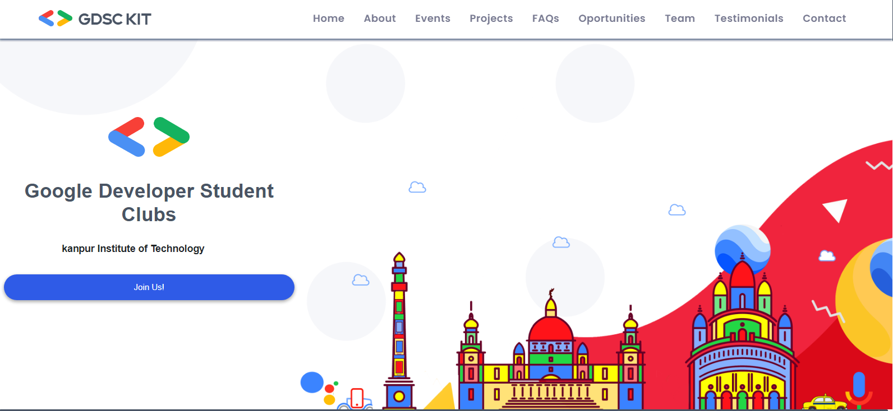
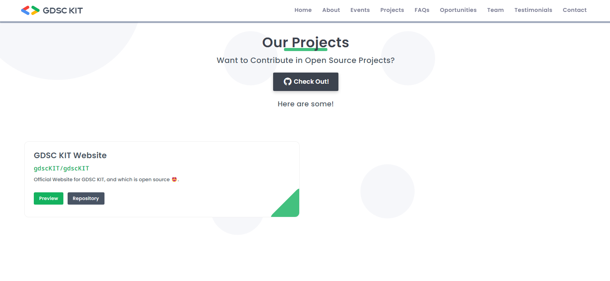
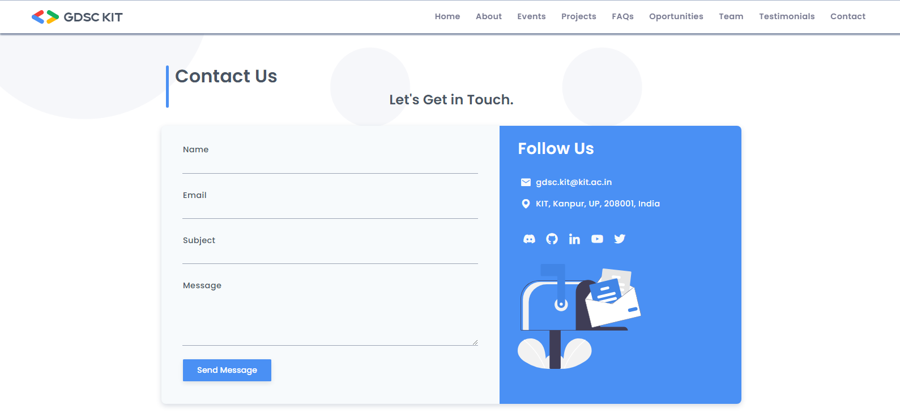

<h1 align="center">GDSC-KIT</h1>


<p align="center">
  <em> Google Developer Student Clubs!</em>
</p>

<p align="center">
  <a href="#about">About</a> •
  <a href="#features">Features</a> •
  <a href="#tech-stack">Tech Stack</a> •
  <a href="#screenshots">Screenshots</a> •
  <a href="#getting-started">Getting Started</a> •
  <a href="#usage">Usage</a> •
  <a href="#contributing">Contributing</a> •
  <a href="#license">License</a>
</p>

---

Welcome to **GDSC-KIT** - The Ultimate Resource Hub for Google Developer Student Clubs Worldwide! 🌍✨


## :rocket: About

GDSC-KIT is not just another repository; it's a digital playground for GDSC enthusiasts! Our mission is to provide GDSC organizers and members with the tools they need to make their tech community thrive.

## :star2: Features

- **Open Source**: GDSC-KIT is open-source, allowing you to contribute your resources, enhancements, and ideas back to the GDSC community, fostering growth and innovation.


- **User-Friendly Interface**: GDSC-KIT boasts an intuitive and user-friendly interface, making it easy for organizers and members to navigate and find valuable resources.

- **Comprehensive Guide**: Step-by-step guides on event organization, club management, and community building - your secret sauce for success!

- **Global Network**: Connect with GDSCs worldwide, exchange success stories, and learn from each other.

- **Inspiration Station**: Get inspired by real-world GDSC success stories and case studies, and take your club to the next level.

These features are designed to empower GDSC organizers and members in their mission to build thriving tech communities on their campuses.

## :wrench: Tech Stack

- **Frontend**: 
  - HTML 5
  - CSS 3
  - JavaScript 
  
- **Version Control**: 
  - Git and GitHub


## :camera: Screenshots

Here are some stunning screenshots of GDSC-KIT in action:


   

   


   
   

 ## Before You Start

- Always maintain the **file format & folder structure.**
- Maintain proper file names (i.e, for images).
- Don't use capital or spaces for files names instead use `_` or `-`.

---


<!-- GETTING STARTED -->

## :sparkles: Getting Started

We're thrilled to have you contribute to GDSC-KIT! Share your own templates, resources, or enhancements to make this website even more amazing:

Below are the steps to follow to contribute to this project:

**1.** Fork [this](https://github.com/Ankit-0310/GDSC-KIT) repository.

**2.** Clone your forked copy of the project.

```
git clone https://github.com/<your_user_name>/Ankit-0310/GDSC-KIT.git
```

where `your_user_name` is your GitHub username.

**3.** Navigate to the project directory :file_folder: .

```
cd Ankit-0310/GDSC-KIT
```

**4.** Add a reference(remote) to the original repository.

```
git remote add upstream https://github.com/Ankit-0310/GDSC-KIT.git
```

**5.** Check the remotes for this repository.

```
git remote -v
```

**6.** Always take a pull from the upstream repository to your main branch to keep it at par with the main project(updated repository).

```
git pull upstream main
```

**7.** Create a new branch.

```
git checkout -b <your_branch_name>
```

**8.** Make necessary changes and commit those changes

**9.** Track your changes.

```
git add .
```

**10.** Commit your changes .

```
git commit -m "Commit message"
```

**11.** Push the committed changes in your feature branch to your remote repo.

```
git push -u origin <your_branch_name>
```

**12.** To create a pull request, click on `compare and pull requests`. Please ensure you compare your feature branch to the desired branch of the repo you are suppose to make a PR to.

**13.** Add appropriate title and description to your pull request explaining your changes and efforts done.

**14.** Click on `Create Pull Request`.

**15.** And you are done creating a pull request to this project. Be patient while we review your code and merge the changes.

Check out our detailed [Contribution Guidelines](CONTRIBUTING.md) for the full scoop.


## :rocket: Getting Started

Ready to embark on your GDSC-KIT journey? Follow these simple steps:

1. **Clone** this repository to your local machine.
2. **Explore** the wealth of resources at your fingertips.
3. **Customize** templates and materials to give your GDSC a unique identity.
4. **Contribute** your own resources and improvements to give back to the community.

## :zap: Usage

GDSC-KIT is designed with simplicity in mind. Here's how you can put it to use:

- **Customize** event posters for your club's next epic hackathon.
- **Utilize** presentation templates for workshops that will leave your members in awe.
- **Challenge** your members with coding puzzles to boost their skills.
- **Navigate** the guides for masterful event organization.


## :telephone_receiver: Contact Us

Got questions, suggestions, or just want to chat? Feel free to reach out to us:

- **Email**: [ankitarya753@gmail.com](mailto:ankitarya753@gmail.com)

## :page_with_curl: License

GDSC-KIT operates under the [MIT License](LICENSE.md). Feel the freedom to use, tweak, and share these resources for your GDSC activities.

---

We're excited to have GDSC-KIT become your GDSC's secret weapon. For any queries or brilliant ideas, don't hesitate to [open an issue](https://github.com/Ankit-0310/GDSC-KIT/issues). Let's code, inspire, and build an extraordinary tech community together! 🚀🔥

